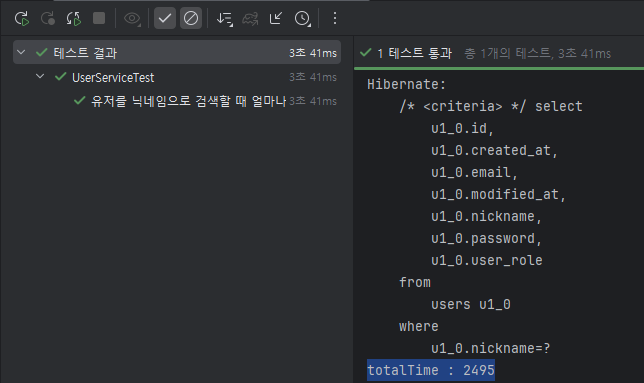
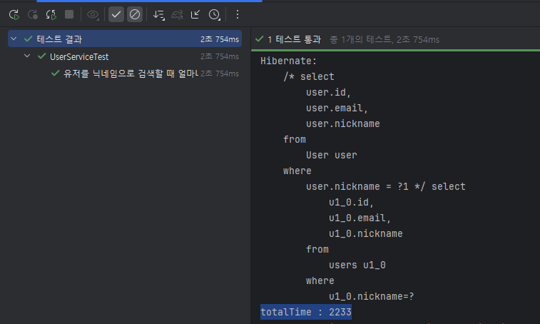
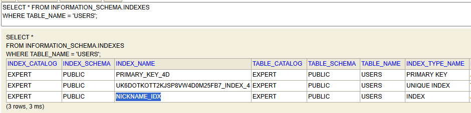
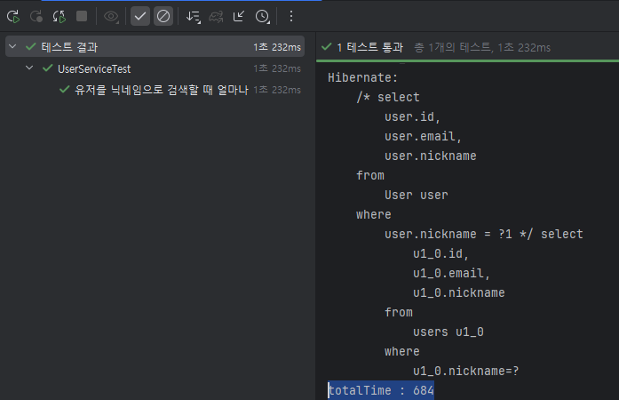

# SPRING PLUS

## 13. 대용량 데이터 처리

유저 데이터 100만건을 생성한 뒤, 닉네임으로 유저를 조회하면 **테스트가 3.41초**가 걸리며, **조회 시 2.495초**가 걸린다.

## 개선1 : 프로젝션(Projection) 사용

모든 유저 정보가 필요없기 때문에, 필요한 정보만 조회하게 되면 성능이 좋아질 것이라 생각했다.

    id, email, nickname password, user_role, create_at, modified_at

여기서 실제 반환하는 값은 `id`, `email`, `nickname`만 있기에, 이들만 조회하도록 변경했다.

### 결과

**테스트는 2.754초, 조회는 2.233초로**, 조회 속도가 **미세하게 감소**했다.

실제로 여러번 실행하게 되면 기존보다 늘어나는 경우가 있어, 큰 영향이 없다.

## 개선2 : 인덱스

인덱스를 사용하면 생성이나 수정, 삭제와 같이 데이터를 변화시키는 과정에는 비효율적이지만, 데이터 조회를 빠르게 해준다.

`nickname`을 기준으로 인덱스 `nickname_idx`를 생성했다.

### 결과

**테스트는 1.232초, 조회는 0.684초** 만에 조회했다.

이전보다 확실하게 조회 속도가 감소했다.

